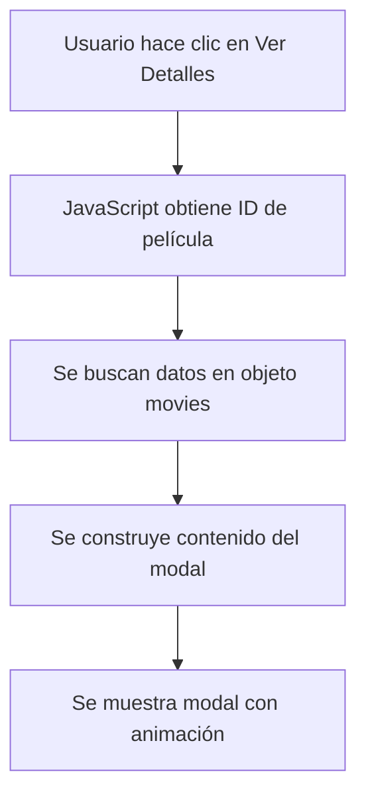

# 📚 Guía de Estudio - TrailerPelis

## Índice de Contenidos
- [Conceptos Básicos](#conceptos-básicos)
- [HTML en Detalle](#html-en-detalle)
- [CSS en Profundidad](#css-en-profundidad)
- [JavaScript Explicado](#javascript-explicado)

## Conceptos Básicos

### Estructura del Proyecto
Este proyecto utiliza una arquitectura de tres capas:
1. HTML (estructura)
2. CSS (estilos)
3. JavaScript (interactividad)

### Archivos Principales y sus Roles

#### 1. index.html
```html
<!DOCTYPE html>
<html lang="en">
<head>
    <!-- Aquí se cargan los estilos y meta información -->
</head>
<body>
    <!-- Estructura principal -->
    <div class="encabezado">
        <!-- El encabezado contiene el título y menú de navegación -->
    </div>
    
    <div class="cartelera">
        <!-- Aquí se muestran todas las películas -->
    </div>
    
    <div class="modal">
        <!-- Modal para mostrar detalles de películas -->
    </div>
</body>
</html>
```

### Explicación Paso a Paso

#### 1. Cómo se Muestra una Película
```html
<!-- 1. Primero, tenemos la tarjeta de película en el HTML -->
<div class="pelicula">
    
    <div class="info-pelicula">
        <h3>Título Película</h3>
        <button class="btn-detalles" data-movie="1">Ver detalles</button>
    </div>
</div>

<!-- 2. Cuando se hace clic, el JavaScript procesa el evento -->
<script>
// El código en script.js maneja el clic
document.addEventListener('click', (e) => {
    if (e.target.matches('.btn-detalles')) {
        const movieId = e.target.dataset.movie;
        openModal(movieId); // Abre el modal con los detalles
    }
});
</script>
```

#### 2. Sistema de Variables CSS
```css
/* Ejemplo de cómo se usan las variables en el proyecto */
:root {
    --color-primary: #8B1A0E;
}

.btn-detalles {
    background-color: var(--color-primary);
}
```

## Ejercicios Prácticos

### 1. Agregar una Nueva Película
```javascript
// En script.js, añade una nueva película así:
const movies = {
    6: {  // Nuevo ID
        title: "Nueva Película",
        genre: "Acción",
        duration: "2h 30m",
        rating: "PG-13",
        releaseDate: "2024",
        cast: "Actor 1, Actor 2",
        director: "Director",
        trailer: "URL_YouTube",
        imdb: "URL_IMDB"
    }
};
```

### 2. Personalizar Estilos
```css
/* Ejemplo de personalización de una tarjeta de película */
.pelicula {
    /* Modifica estas propiedades para cambiar el aspecto */
    background-color: var(--bg-card);
    border-radius: var(--border-radius-md);
    transition: transform var(--transition-normal);
}
```

## Flujos de Trabajo Comunes

### 1. Ciclo de Vida de un Modal


### 2. Sistema de Navegación
```javascript
// Ejemplo de cómo funciona el menú desplegable
function toggleMenu(menuId) {
    const menu = document.querySelector(`#${menuId}`);
    closeAllMenus();  // Cierra otros menús
    menu.style.display = menu.style.display === 'block' ? 'none' : 'block';
}
```

## Referencias a la Documentación

- [Documentación CSS Detallada](./CSS_DOCUMENTATION.md)
- [Documentación JavaScript](./JS_DOCUMENTATION.md)
- [Documentación HTML](./HTML_DOCUMENTATION.md)

## Tips para Debugging

### Problemas Comunes y Soluciones

1. **Modal no se abre**
```javascript
// Verifica en la consola:
console.log('ID de película:', movieId);
console.log('Datos de película:', movies[movieId]);
```

2. **Estilos no se aplican**
```css
/* Asegúrate de que las variables CSS están definidas */
:root {
    /* Verifica que estas variables existen */
    --color-primary: #8B1A0E;
    --bg-card: rgba(20, 20, 35, 0.41);
}
```

## Ejemplos de Personalización

### 1. Cambiar el Tema
```css
:root {
    /* Ejemplo de tema oscuro */
    --color-primary: #ff4444;
    --bg-main: #000000;
    --text-primary: #ffffff;
}
```

### 2. Agregar Nuevas Funcionalidades
```javascript
// Ejemplo: Agregar sistema de favoritos
function addToFavorites(movieId) {
    const favorites = JSON.parse(localStorage.getItem('favorites') || '[]');
    favorites.push(movieId);
    localStorage.setItem('favorites', JSON.stringify(favorites));
}
```

## Recursos Adicionales

### Enlaces Útiles
- [MDN Web Docs - Grid](https://developer.mozilla.org/en-US/docs/Web/CSS/CSS_Grid_Layout)
- [MDN Web Docs - Flexbox](https://developer.mozilla.org/en-US/docs/Web/CSS/CSS_Flexible_Box_Layout)
- [YouTube iFrame API](https://developers.google.com/youtube/iframe_api_reference)

### Herramientas Recomendadas
- Visual Studio Code
- Chrome DevTools
- Git para control de versiones
